<!-- Header Banner -->

<!-- Dynamic Animated Header -->

 

<!-- Interactive Navigation Bar -->

  <a href="#-who-i-am"><b>🧑‍💻 WHO I AM</b></a> &nbsp;•&nbsp; 
  <a href="#%EF%B8%8F-skills--technologies"><b>🛠️ SKILLS & TOOLS</b></a> &nbsp;•&nbsp; 
  <a href="#-featured-projects"><b>🚀 PROJECTS</b></a> &nbsp;•&nbsp; 
  <a href="#-github-activity"><b>📊 ACTIVITY</b></a> &nbsp;•&nbsp; 
  <a href="#-lets-build-something"><b>📬 CONTACT</b></a>

 

<!-- Action Badges -->

  

**Think → Build → Debug → Learn → Improve**

 

## 🧑‍💻 Who I Am

I work across **software, data, IoT, and AI-assisted development** rather than one narrow lane. My core strength is backend development in **Python + Flask**, working with **SQL/NoSQL databases**, building **ETL pipelines**, and designing and testing **REST APIs**.

I've also built **IoT-integrated systems** — connecting Arduino sensors to software over serial with real-time data logging — and I use **AI tools deliberately** (*ChatGPT, Gemini, Claude, GitHub Copilot*) to speed up debugging and iteration, not to replace understanding the system I'm building.

 

 

## 🛠️ Skills & Technologies

<!-- Animated Moving Marquees (Pure Animated SVGs) -->

### ⚡ Technologies & Frameworks

  

 

### 🤖 Developer Tools & AI Stack

  

 

### 🎯 Skill Badges

**Programming & Backend**  

 

**Data & Databases**  

 

**IoT & Hardware Systems**  

 

**Cloud, Tools & AI**  

  

## 🚀 Featured Projects

### 🌾 AgriPrice Intelligence — AI-Powered Tamil Nadu Market Price Advisory System
`Python` • `Flask` • `PostgreSQL (Neon Cloud)` • `Google Gemini AI` • `REST API` • `Render`

- ⚡ **Automated ETL Pipeline**: Built a Python-based ETL pipeline to process over **6,000+ daily records**, featuring incremental data loading and automated retention on Neon Cloud Database.
- 📈 **Price Prediction Engine**: Developed and debugged a price prediction engine, validating outputs against live market data.
- 🔌 **REST API Architecture**: Developed and tested Flask REST APIs using Postman with structured API documentation.
- ☁️ **Cloud Deployment**: Deployed on Render, troubleshooting runtime issues and integrating live weather data.
 
### 👥 Smart PQ Counter — People Counting & Occupancy Alert System
`Python` • `Flask` • `MySQL` • `Arduino` • `PySerial` • `smtplib` • `Team Project`

- 🤝 **IoT & Hardware Integration**: Collaborated within a team to develop a real-time occupancy monitoring application integrating Arduino sensors with Flask.
- 🗄️ **Database Persistence**: Debugged MySQL data logging and verified accuracy of persistent occupancy records.
- 🚨 **Automated Alerting**: Implemented automated email alerts and performed basic troubleshooting for occupancy threshold events.

 

## 📊 GitHub Activity

 

 

## 📬 Let's Build Something

I'm always up for talking **Python, backend systems, data pipelines, IoT, or AI-assisted engineering**.

 

<!-- Footer Banner -->

